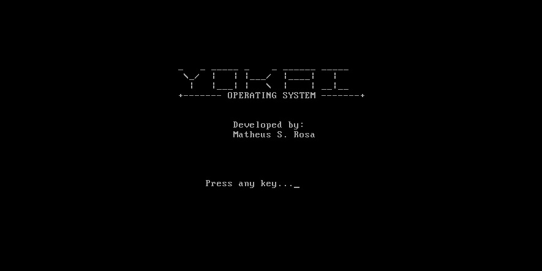

# 🖥️ YOKAI Bootloader

Um bootloader simples em Assembly x86. 🚀

---



---

🔧 Como compilar e testar
🛠️ Instalações necessárias
Antes de começar, você precisa ter o NASM (Netwide Assembler) e o QEMU (Quick Emulator) instalados na sua máquina.

Para sistemas baseados em Debian/Ubuntu:

```Bash

sudo apt update
sudo apt install nasm qemu-system-x86
```

Para sistemas baseados em Arch Linux:

```Bash

sudo pacman -S nasm qemu

```

1️⃣ Compilar o bootloader
```Bash

nasm -f bin bootloader.asm -o bootloader.bin

```
2️⃣ Testar no QEMU
```Bash

qemu-system-x86_64 -drive format=raw,file=bootloader.bin

```

✨ Autor
Desenvolvido por Matheus S. Rosa 
